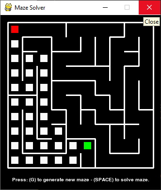

# Python Maze Generator
**Description:** This python script uses recursion to solve a maze. The PyGame library was used to display the maze. I created this algorithm to challenge myself, during my self quarantine from Covid-19. The maze is created with the generateMaze script.

## Algorithm Explained:
- The script keeps track of a path (list of coordinates), which starts at 0, 0.
- The solveMaze function recursively extends the path through the maze.
- When the path hits a wall, it will backtrack and trim back the path, since that section was a dead end.
- The recursion continues to search the maze until it reaches the target, or 'end' of the maze.

## Extra Information:
**Modify the code:** Use the [Trinket](https://trinket.io/pygame/c8d9fe3965) service to edit and remix the code live in the browser *(without setting up pygame)*

>*Set up Pygame to run the code locally:* [Add Pygame](https://stackoverflow.com/questions/28453854/add-pygame-module-in-pycharm-id)

*Note:* This program was started on July 4th, 2020, at 3:45 PM, finished on 7/11/2020 at 12:05 PM. 